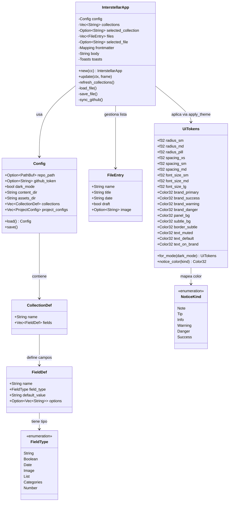

```mermaid
classDiagram
    class InterstellarApp {
        -Config config
        -Vec~String~ collections
        -Option~String~ selected_collection
        -Vec~FileEntry~ files
        -Option~String~ selected_file
        -Mapping frontmatter
        -String body
        -Toasts toasts
        +new(cc) InterstellarApp
        +update(ctx, frame)
        -refresh_collections()
        -load_file()
        -save_file()
        -sync_github()
    }

    class Config {
        +Option~PathBuf~ repo_path
        +Option~String~ github_token
        +bool dark_mode
        +String content_dir
        +String assets_dir
        +Vec~CollectionDef~ collections
        +Vec~ProjectConfig~ project_configs
        +load() Config
        +save()
    }

    class CollectionDef {
        +String name
        +Vec~FieldDef~ fields
    }

    class FieldDef {
        +String name
        +FieldType field_type
        +String default_value
        +Option~Vec~String~~ options
    }

    class FileEntry {
        +String name
        +String title
        +String date
        +bool draft
        +Option~String~ image
    }

    class FieldType {
        <<enumeration>>
        String
        Boolean
        Date
        Image
        List
        Categories
        Number
    }

    class UiTokens {
        +f32 radius_sm
        +f32 radius_md
        +f32 radius_pill
        +f32 spacing_xs
        +f32 spacing_sm
        +f32 spacing_md
        +f32 font_size_sm
        +f32 font_size_md
        +f32 font_size_lg
        +Color32 brand_primary
        +Color32 brand_success
        +Color32 brand_warning
        +Color32 brand_danger
        +Color32 panel_bg
        +Color32 subtle_bg
        +Color32 border_subtle
        +Color32 text_muted
        +Color32 text_default
        +Color32 text_on_brand
        +for_mode(dark_mode) UiTokens
        +notice_color(kind) Color32
    }

    class NoticeKind {
        <<enumeration>>
        Note
        Tip
        Info
        Warning
        Danger
        Success
    }

    InterstellarApp --> Config : usa
    InterstellarApp --> FileEntry : gestiona lista
    InterstellarApp --> UiTokens : aplica via apply_theme
    Config --> CollectionDef : contiene
    CollectionDef --> FieldDef : define campos
    FieldDef --> FieldType : tiene tipo
    UiTokens --> NoticeKind : mapea color
```
