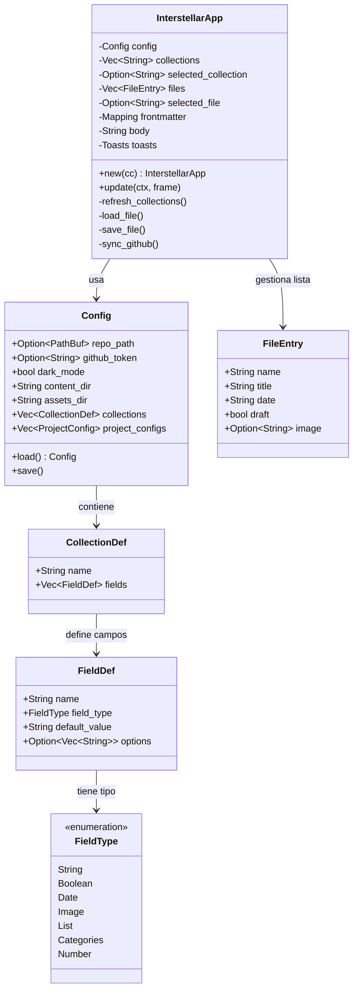

```mermaid
classDiagram
    class InterstellarApp {
        -Config config
        -Vec~String~ collections
        -Option~String~ selected_collection
        -Vec~FileEntry~ files
        -Option~String~ selected_file
        -Mapping frontmatter
        -String body
        -Toasts toasts
        +new(cc) InterstellarApp
        +update(ctx, frame)
        -refresh_collections()
        -load_file()
        -save_file()
        -sync_github()
    }

    class Config {
        +Option~PathBuf~ repo_path
        +Option~String~ github_token
        +bool dark_mode
        +String content_dir
        +String assets_dir
        +Vec~CollectionDef~ collections
        +Vec~ProjectConfig~ project_configs
        +load() Config
        +save()
    }

    class CollectionDef {
        +String name
        +Vec~FieldDef~ fields
    }

    class FieldDef {
        +String name
        +FieldType field_type
        +String default_value
        +Option~Vec~String~~ options
    }

    class FileEntry {
        +String name
        +String title
        +String date
        +bool draft
        +Option~String~ image
    }

    class FieldType {
        <<enumeration>>
        String
        Boolean
        Date
        Image
        List
        Categories
        Number
    }

    InterstellarApp --> Config : usa
    InterstellarApp --> FileEntry : gestiona lista
    Config --> CollectionDef : contiene
    CollectionDef --> FieldDef : define campos
    FieldDef --> FieldType : tiene tipo
```
