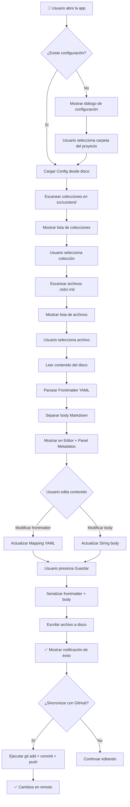

```mermaid
flowchart TD
    A[🚀 Usuario abre la app] --> B{¿Existe configuración?}
    
    B -->|Sí| C[Cargar Config desde disco]
    B -->|No| D[Mostrar diálogo de configuración]
    
    D --> E[Usuario selecciona carpeta del proyecto]
    E --> C
    
    C --> F[Escanear colecciones en src/content/]
    F --> G[Mostrar lista de colecciones]
    
    G --> H[Usuario selecciona colección]
    H --> I[Escanear archivos .mdx/.md]
    I --> J[Mostrar lista de archivos]
    
    J --> K[Usuario selecciona archivo]
    K --> L[Leer contenido del disco]
    L --> M[Parsear Frontmatter YAML]
    M --> N[Separar body Markdown]
    N --> O[Mostrar en Editor + Panel Metadatos]
    
    O --> P{Usuario edita contenido}
    P -->|Modificar frontmatter| Q[Actualizar Mapping YAML]
    P -->|Modificar body| R[Actualizar String body]
    
    Q --> S[Usuario presiona Guardar]
    R --> S
    
    S --> T[Serializar frontmatter + body]
    T --> U[Escribir archivo a disco]
    U --> V[✅ Mostrar notificación de éxito]
    
    V --> W{¿Sincronizar con GitHub?}
    W -->|Sí| X[Ejecutar git add + commit + push]
    X --> Y[✅ Cambios en remoto]
    W -->|No| Z[Continuar editando]
```
