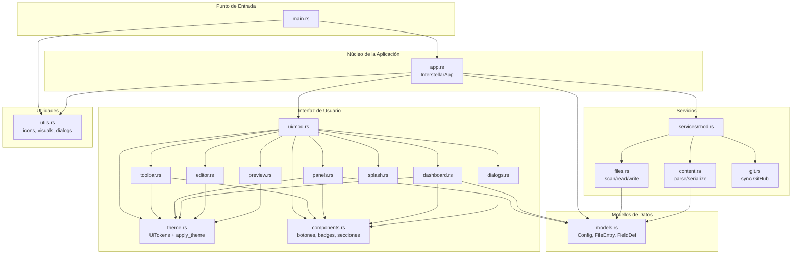

```mermaid
graph TB
    subgraph "Punto de Entrada"
        MAIN[main.rs]
    end

    subgraph "Núcleo de la Aplicación"
        APP[app.rs<br/>InterstellarApp]
    end

    subgraph "Modelos de Datos"
        MODELS[models.rs<br/>Config, FileEntry, FieldDef]
    end

    subgraph "Servicios"
        SRV_MOD[services/mod.rs]
        SRV_CONTENT[content.rs<br/>parse/serialize]
        SRV_FILES[files.rs<br/>scan/read/write]
        SRV_GIT[git.rs<br/>sync GitHub]
    end

    subgraph "Interfaz de Usuario"
        UI_MOD[ui/mod.rs]
        UI_THEME[theme.rs<br/>UiTokens + apply_theme]
        UI_COMPONENTS[components.rs<br/>botones, badges, secciones]
        UI_TOOLBAR[toolbar.rs]
        UI_PANELS[panels.rs]
        UI_DASHBOARD[dashboard.rs]
        UI_EDITOR[editor.rs]
        UI_PREVIEW[preview.rs]
        UI_DIALOGS[dialogs.rs]
        UI_SPLASH[splash.rs]
    end

    subgraph "Utilidades"
        UTILS[utils.rs<br/>icons, visuals, dialogs]
    end

    MAIN --> APP
    MAIN --> UTILS

    APP --> MODELS
    APP --> SRV_MOD
    APP --> UI_MOD
    APP --> UTILS

    SRV_MOD --> SRV_CONTENT
    SRV_MOD --> SRV_FILES
    SRV_MOD --> SRV_GIT

    UI_MOD --> UI_THEME
    UI_MOD --> UI_COMPONENTS
    UI_MOD --> UI_TOOLBAR
    UI_MOD --> UI_PANELS
    UI_MOD --> UI_DASHBOARD
    UI_MOD --> UI_EDITOR
    UI_MOD --> UI_PREVIEW
    UI_MOD --> UI_DIALOGS
    UI_MOD --> UI_SPLASH

    UI_TOOLBAR --> UI_THEME
    UI_TOOLBAR --> UI_COMPONENTS
    UI_PANELS --> UI_THEME
    UI_PANELS --> UI_COMPONENTS
    UI_DASHBOARD --> UI_THEME
    UI_DASHBOARD --> UI_COMPONENTS
    UI_EDITOR --> UI_THEME
    UI_PREVIEW --> UI_THEME
    UI_DIALOGS --> UI_COMPONENTS

    UI_PANELS --> MODELS
    UI_DASHBOARD --> MODELS
    SRV_FILES --> MODELS
    SRV_CONTENT --> MODELS
```
