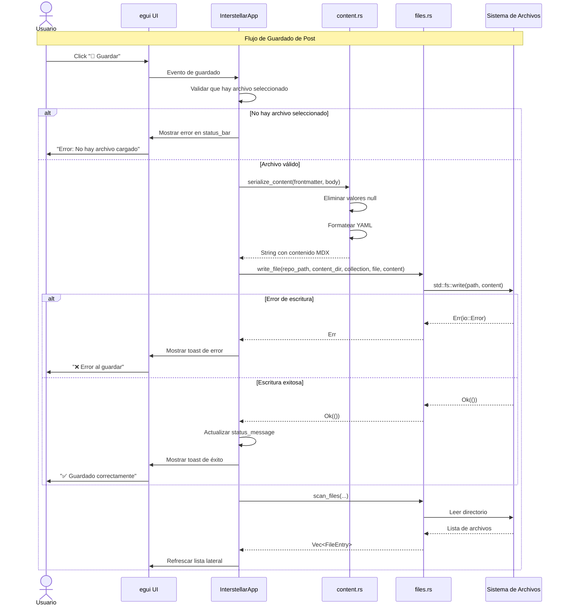

```mermaid
sequenceDiagram
    actor User as Usuario
    participant UI as egui UI
    participant App as InterstellarApp
    participant Content as content.rs
    participant Files as files.rs
    participant FS as Sistema de Archivos

    Note over User,FS: Flujo de Guardado de Post

    User->>UI: Click "💾 Guardar"
    UI->>App: Evento de guardado
    
    App->>App: Validar que hay archivo seleccionado
    
    alt No hay archivo seleccionado
        App->>UI: Mostrar error en status_bar
        UI->>User: "Error: No hay archivo cargado"
    else Archivo válido
        App->>Content: serialize_content(frontmatter, body)
        Content->>Content: Eliminar valores null
        Content->>Content: Formatear YAML
        Content-->>App: String con contenido MDX
        
        App->>Files: write_file(repo_path, content_dir, collection, file, content)
        Files->>FS: std::fs::write(path, content)
        
        alt Error de escritura
            FS-->>Files: Err(io::Error)
            Files-->>App: Err
            App->>UI: Mostrar toast de error
            UI->>User: "❌ Error al guardar"
        else Escritura exitosa
            FS-->>Files: Ok(())
            Files-->>App: Ok(())
            App->>App: Actualizar status_message
            App->>UI: Mostrar toast de éxito
            UI->>User: "✅ Guardado correctamente"
        end
        
        App->>Files: scan_files(...)
        Files->>FS: Leer directorio
        FS-->>Files: Lista de archivos
        Files-->>App: Vec<FileEntry>
        App->>UI: Refrescar lista lateral
    end
```
