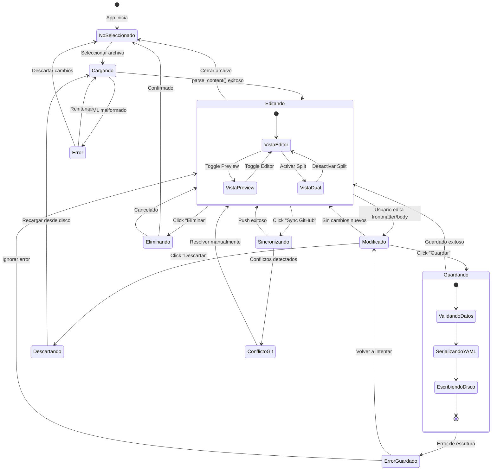

```mermaid
stateDiagram-v2
    [*] --> NoSeleccionado: App inicia

    NoSeleccionado --> Cargando: Seleccionar archivo
    
    Cargando --> Editando: parse_content() exitoso
    Cargando --> Error: YAML malformado
    
    Error --> Cargando: Reintentar
    Error --> NoSeleccionado: Descartar cambios
    
    Editando --> Modificado: Usuario edita frontmatter/body
    
    Modificado --> Guardando: Click "Guardar"
    Modificado --> Editando: Sin cambios nuevos
    Modificado --> Descartando: Click "Descartar"
    
    Descartando --> Cargando: Recargar desde disco
    
    Guardando --> Editando: Guardado exitoso
    Guardando --> ErrorGuardado: Error de escritura
    
    ErrorGuardado --> Modificado: Volver a intentar
    ErrorGuardado --> Editando: Ignorar error
    
    Editando --> Sincronizando: Click "Sync GitHub"
    
    Sincronizando --> Editando: Push exitoso
    Sincronizando --> ConflictoGit: Conflictos detectados
    
    ConflictoGit --> Editando: Resolver manualmente
    
    Editando --> NoSeleccionado: Cerrar archivo
    Editando --> Eliminando: Click "Eliminar"
    
    Eliminando --> NoSeleccionado: Confirmado
    Eliminando --> Editando: Cancelado

    state Editando {
        [*] --> VistaEditor
        VistaEditor --> VistaPreview: Toggle Preview
        VistaPreview --> VistaEditor: Toggle Editor
        VistaEditor --> VistaDual: Activar Split
        VistaDual --> VistaEditor: Desactivar Split
    }

    state Guardando {
        [*] --> ValidandoDatos
        ValidandoDatos --> SerializandoYAML
        SerializandoYAML --> EscribiendoDisco
        EscribiendoDisco --> [*]
    }
```
